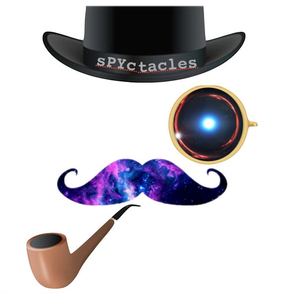

#DeepLenStronomy

> Welcome to DeepLenstronomy, a wrapper that enables pipelining of the lenstronomy package for efficient and fast simulations of strong gravitational lensing systems. 

# Table of Contents 

- [Installation](#installation)
- [Features](#features)
- [Contributing](#contributing)
- [Team](#team)

---

# Installation

- you can use pip to install the code
- you will need to install lenstronomy, which has requirements: link to requirments

---

# Features

## Pipeline Structure

The structure of the pipeline is as follows:

1. Inputs 
   1. YAML file
2. Generate objects
   1. with some population samplnig
   2. with some instrument/experiment characteristics
   3. of a given type or species
3. Run Diagnostics over sets of objects
   1. Display distributions of object parameters
   2. Show examples of objects

The primary elements of the simulated objects are

1. Survey Model (noise and data fidelity): seeing (dist, per band), sky-brightness (dist; corr with seeing; per band?), zero-point (const; per band?), exp time (per band), num exposures, pixel scale (const), read noise, filter set
2. Expected population distribution 
3. Injection simulations into real data for the given survey or model
4. Sky noise: poisson (from lens, source, uniform sky bkg)
5. A wide selection of strong lens species including gal-gal, gal-qso, gal-sn, multi-plane, cluster

# Contributing

> To get started install the code!

## Options for contributions

We now have a good structure to the code, and all the pieces are pulled together, so the next stages of the development will be more clearly planned out. 

We see the set of tasks below as the next things we need to do

* bayeseisan hierachical models for efficient sampling
* distribution sampling
* use tensor 2 tensor or gal 2 gal for data structures and as a way to track data sets
* unit tests
* documentation
* conda install

If you'd like to sign up to work on one of these elements, please contact Morgan or Nord.

Aside from those, the most important thing you can do is **try to break the alpha version!**

---

# Team

* Simon Birrer (r)
* Joshua Yao-Yu Lin (r)
* Rob Morgan (w)
* Brian Nord (w)
* Jason Poh (r)

.. image:: https://badge.fury.io/py/deeplenstronomy.png
    :target: http://badge.fury.io/py/deeplenstronomy

.. image:: https://travis-ci.org/bnord/deeplenstronomy.png?branch=master
    :target: https://travis-ci.org/bnord/deeplenstronomy

